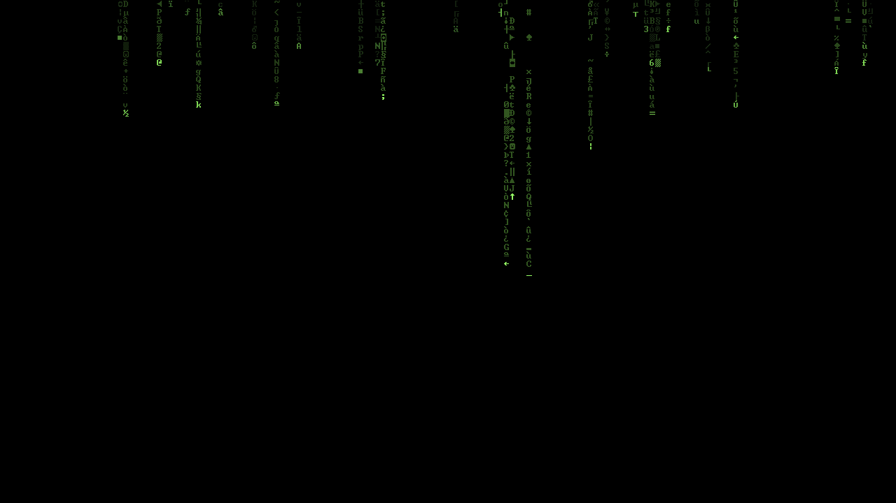

Matrix Screen Saver
===================

A really lightweight Screen Saver that looks something like this:

Freeze-frame at 1920x1080: [FullHD screenshot](screenshots/MatrixSS_1920x1080.png).

A bit of history
----------------

This is an updated version of Louai Munajim's Matrix screen saver, the simplest, and best one, ever created.

Thanks Louai! I've used it for way too many years!

Sadly the original acts kind of funny (not usable at all) on Windows XP and upwards, thus, this version.

I've originally made this version in 2015, but never published. Six and a half years later:

Now that a new Matrix movie is near (Dec 2021), it is time for this screen-saver's resurrection!

(Narrator in 2023: Matrix Resurrections was a "meh" at best, oh well, MatrixSS still rocks!)

Changes on this version
-----------------------

* Changed from a standard Windows 9x .exe to a proper screen saver binary:
  * Makes it work on Windows XP (tested also on 7 32 bits, and 10 64 bit).
  * Also makes the preview work in the [Screen Saver selection dialog](screenshots/MatrixSS_Win7-ScreenSaverDialog.png)
* Somewhat cleaner source code (at least, in my opinion, YMMV).
* Multi-monitor support (since v1.1).

What is it good for
-------------------

* Screen saving.
* Making your friends go: "Whoa!".
* Learning how to write a screen saver on Windows.
* Exercising my rusty programming skills.
* Serve as a base for a future port for Haiku OS.

Usage:
------

Download the [MatrixSS-v1.1.7z](https://github.com/OscarL/MatrixSS/releases/download/v1.1/MatrixSS-v1.1.7z) file, extract "MatrixSS.scr" to a suitable directory, right-click on it, select: "Test", "Config", or "Install" as you wish.

Building
--------

MinGW64 was used for compiling. Other compilers might work, if you modify the make file accordingly (not tested).

Sadly, MinGW64's version of the "scrnsave" library is broken. More precicely, it contains NO code at all (the "scrnsave.c" file is wrapped in a big "#if 0", so no code gets actually compiled). That of course forbids using it to write screensavers for Windows.

This repository contains the needed code to generate a working version of that library.

You may choose to build it, and maybe replace the non-working version that cames with MinGW. That is only necessary if you intend to compile other screensavers using libscnsave, of course.

So... how to build?

First make sure that the Makefile points to your MinGW64 installation. Edit it to match your setup (I'm using Dev-C++'s portable version, and the Makefile reflects that).

Then just do:

    \> make  (if you have GOW installed)

or

    \> mingw32-make  (if you have only MinGW64 installed)

First on the scrnsave directory, and then in the top level one.

And you should get a "MatrixSS.scr" ready to be tested.

Future Plans
------------

Maybe:

* Comment the code so it might be used by bennigers as a learning tool?
* Release my "no-config, compiled as C" version. The default config values are just great (I have never really changed them in 20 years) and the final .scr goes down to just 18 KB! (down to 10 KB after using UPX).
* Setup a newer (current) version of Dev-C++/TDM-GCC, update the makefiles accordingly.

Links
-----

- [Louai's original Matrix ScreenSaver webpage](http://elouai.com/the_matrix_screensaver.php)

The web.archive.org has the original pages (on louai.com) too!: [louai.com/coding.html](https://web.archive.org/web/20010203155900/http://louai.com/coding.html), and [ver 1.2 source code](https://web.archive.org/web/20000914170532if_/http://www.louai.com:80/coding/matrixsrc.zip).

License
-------

Copyright notice on http://elouai.com/the_matrix_screensaver.php:

> All work by eLouai is licensed under a Creative Commons Attribution 3.0 Unported License

So, I'll keep it under [CC by 3.0](http://creativecommons.org/licenses/by/3.0/) here as well, unless otherwise noticed, like, for example, in the scrnsave.c file, which was placed in the public domain by its author (Anders Norlander).

Tools used for this updated version
-----------------------------------

- clink (cmd.exe's console improvements)
- GOW (Gnu on Windows, lightweight ports of common *nix tools)
- Dev-C++ 5.9.2 (IDE)
- MinGW64 (compiler/libraries)
